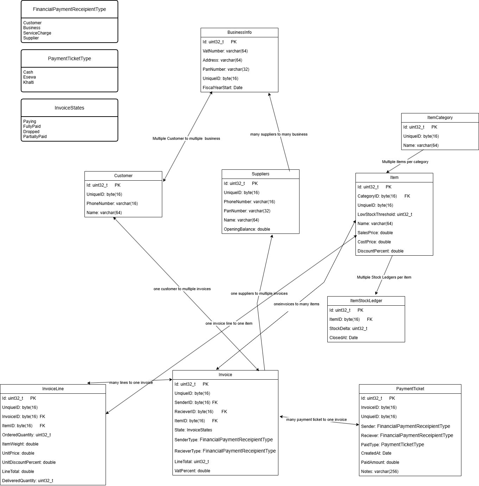

# NepBill
C++ based offline-first SME billing &amp; inventory, A native Windows desktop app (C++, SQLite, Dear ImGui or a thin Win32 UI). Runs 100% offline. Syncs to a local network or USB when internet exists. No subscription needed for core features.

## System Flow

    

